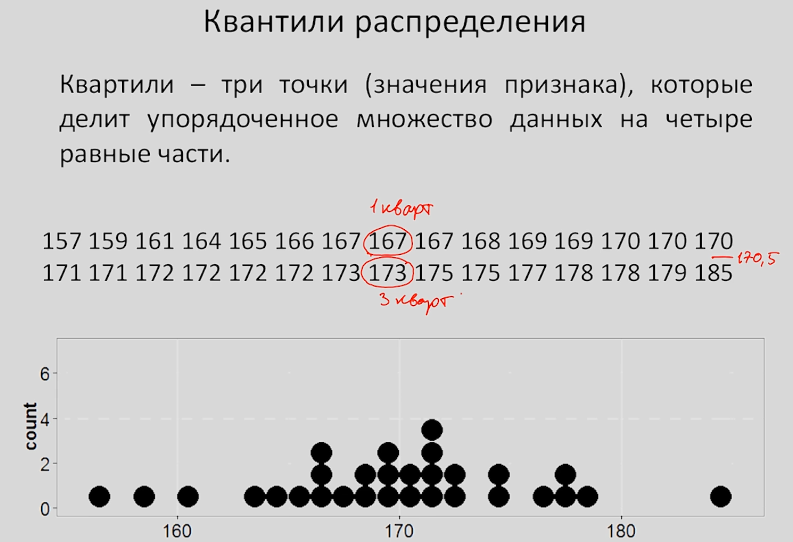
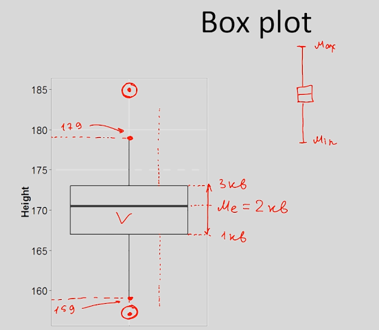
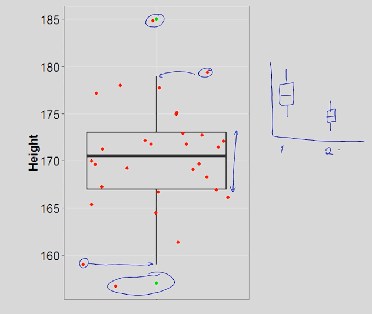

# Квантили распределения

Квантили - такие значения признака, которые делят упорядоченные данные на некоторое число равных частей.

Квартили - такие точки, которые делят наше распределение на 4 равные части.

## Квартили

Делим данные пополам, находим медиану. Медиана = 170,5. Оставшиеся данные разделим ещё раз пополам.

Значение первого квартиля = 167. Значение третьего квартиля равно 173.

Используя квартили можно легко описать наше распределение и построить график box-plot.

## График box-plot.

Этот график отображает много информации о наших данных, его часто называют `ящик с усами`.

Центром ящика является медиана наших данных или второй квартиль, верхняя граница = 3-й квартиль, а нижняя граница = 1-й квартиль.

Почему некоторые точки на графике отображены отдельно?

Если мы посчитаем разность между 3-м и 1-м квартилем - это межквартильный размах (мера изменчивости).

Чем выше межквартильный размах, тем больше вариативность нашего признака.

Отложим мысленно 1,5 межквартильного размаха вверх и вниз от 1-го и 3-го квартилей. Те значения признака, которые последними принадлежат этому промежутку и будут `границами усов`.

Точки, которые превосходят полтора межквартильного размаха - наносятся на график отдельно.

 

Давайте нанесём каждое значение нашего признака на график, чтобы посмотреть, как box-plot соотносится с распределением наших данных.

50% всех наблюдений на промежутке между 1-м и 3-м квартилями.

Этот тип графиков полезен в случаях, когда нужно сравнить две группы между собой.

