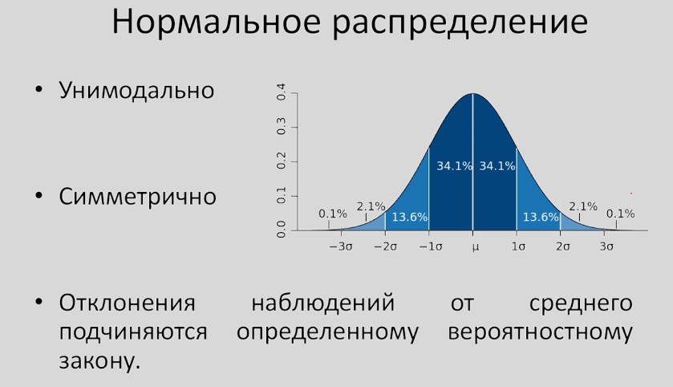
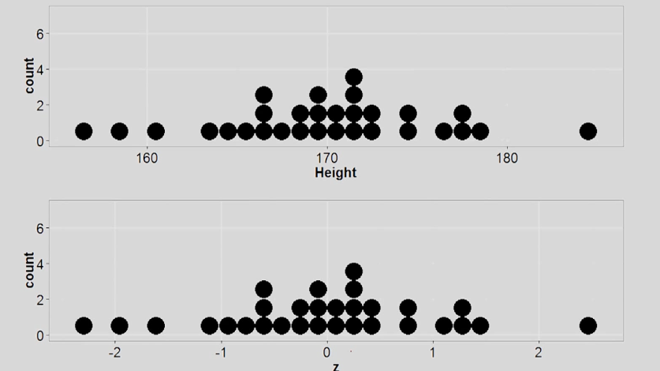
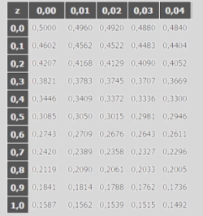

# Нормальное распределение

Мы познакомились с основными описательными статистиками и теперь без труда мы сможем охарактеризовать наши данные с точки зрения выраженности некоторого количественного признака, так и с точки зрения изменчивости нашей переменной.

Для перехода к настоящей статистики нам нужно познакомиться с нормальным распределением. 

Мы видели примеры различных распределений:
+ симметричные
+ унимодальные
+ ассиметричные (смещены вправо или влево)

Статистика очень любит работать с нормальным распределением (унимодальным и симметричным):

Однако, что более важно, отклонения наших значений от среднего будут равновероятны и будут подчиняться определенному вероятностному закону:

+ в диапазоне от среднего до одного стандартного отклонения будет находиться примерно 34% всех наблюдений
+ от 1 до 2-х сигм уже 13,6%
+ от 2-х до 3-х стандартных отклонений - около 2%
+ более 3-х отклонений - примерно 0,1%

Интересен тот факт, что в реальном мире большое количество характеристик и переменных подчиняется нормальному распределению.

Причем интересно не то, что отклонение от среднего равновероятно как в большую, так и меньшую сторону, а то, что сохраняется вероятностное распределение. И этот вероятностный закон предоставляет множество возможностей для статистического анализа.

## Z-стандартизация

**Z-стандартизация** - это такое преобразование данных, позволяющее любую нашу шкалу перевести в шкалу где среднее значение равно 0, а среднеквадратичное отклонение равно 1.

Какой бы признак мы не измерили, мы всегда можем представить данные таким образом.

Как это возможно и как это можно сделать, не потеряв очень важной информации о наших данных?

## Стандартизация

Как абсолютно любые данные преобразовать в такую шкалу, чтобы среднее стало = 0, а дисперсия = 1.

Итак, нам нужно:
+ из каждого наблюдения в нашей выборке отнять среднее значение по выборке

Если мы из каждого наблюдения вычитаем некое число, то и из среднего нам нужно вычесть это число получаем: **среднее - среднее = 0**

+ теперь разделим полученное выражение на стандартное отклонение по нашей выборке

Деление можно рассмотреть, как умножение на число, обратное стандартному отклонению. 
Если каждое значение умножить на число, то нужно и среднее умножить на это число, а дисперсию нужно умножить на квадрат этого числа.

Но `(1 / стандартное отклонение) ** 2 = дисперсия`, а значит D * (1/D) = 1

Неужели такое преобразование не изменит форму распределения?

Как мы видим распределение осталось абсолютно таким же, но только новое среднее стало равным нулю, а стандартное отклонение - единице.

## Правило 2-3-х сигм

Мы уже говорили, что наши значения отклоняются от среднего в соответствии с вероятностным законом:

Все распределения на графике ниже - нормальные, в зависимости от величины стандартного отклонения диапазон +-3 сигмы будет отличен у каждого распределения, но все они будут подчиняться нормальному закону.

Z-преобразование позволяет ответить на вопрос: какой процент наблюдений лежит в абсолютно любом интересующем нас диапазоне.

Пусть:
+ среднее значение = 150
+ стандартное отклонение (sd) = 8

Какой процент наблюдений превосходит значение 154?

1. Делаем z-преобразование:

z = (154 - 150) / 8 = 0,5

Воспользуемся специальной таблицей:

Найдем интересующее нас значение равное 0,5 и увидим, что в диапазоне, превышающем 154 лежит примерно 30% наших наблюдений.

Вероятность встретить значение, превышающее 0,5 в z-шкале равна примерно 0,3.
